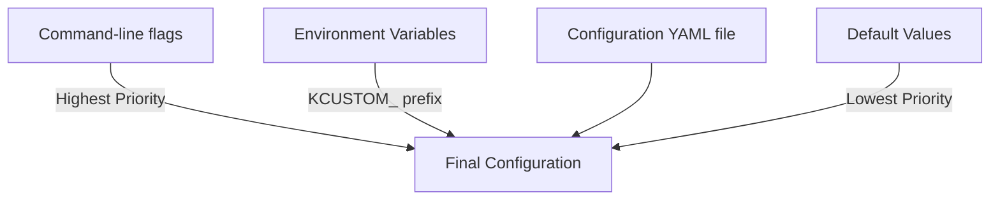
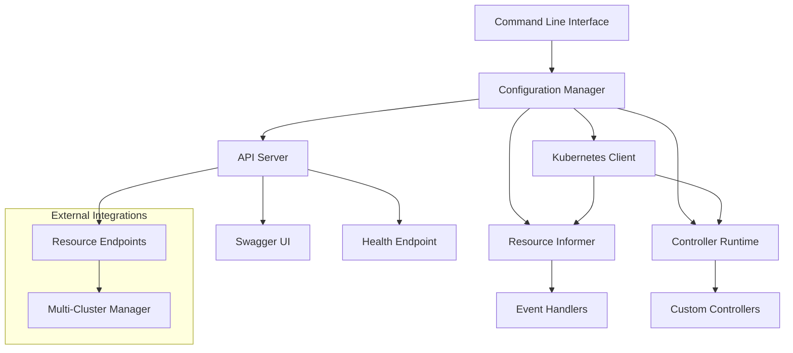
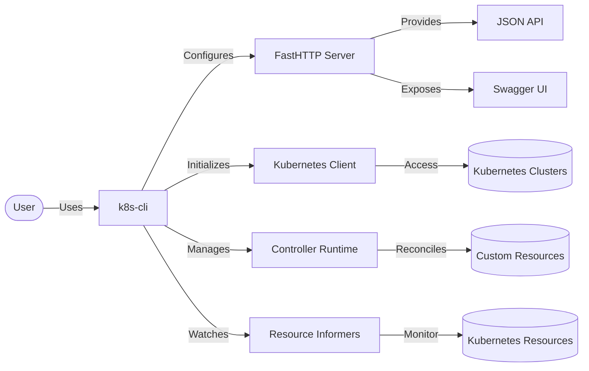
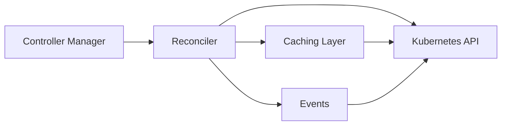

# Kubernetes Custom Controller

[](https://github.com/obezsmertnyi/k8s-custom-controller/actions)
[](https://github.com/obezsmertnyi/k8s-custom-controller/releases)
[](https://github.com/obezsmertnyi/k8s-custom-controller/pkgs/container/k8s-custom-controller%2Fk8s-custom-controller)
[](https://golang.org/)
[](LICENSE)

A powerful Kubernetes management tool built with [Cobra CLI](https://github.com/spf13/cobra), [client-go](https://github.com/kubernetes/client-go), and [controller-runtime](https://github.com/kubernetes-sigs/controller-runtime), providing advanced deployment management and real-time event monitoring capabilities.

## 📑 Table of Contents

- [✨ Features](#-features)
- [🚀 Quick Start](#-quick-start)
- [⚙️ Configuration](#%EF%B8%8F-configuration)
- [🌐 API Server](#-api-server)
- [🎮 Controller Runtime](#-controller-runtime)
- [🐳 Docker Support](#-docker-support)
- [🎯 CLI Commands](#-cli-commands)
- [📁 Project Structure](#-project-structure)
- [🔥 Future Development](#-future-development)
- [📜 License](#-license)

## ✨ Features

- **📋 Multi-Cluster Management**: Monitor deployments across multiple Kubernetes clusters simultaneously
- **👁️ Real-time Informer**: Watch deployment changes with live event logging
- **🎯 Controller-Runtime Integration**: Advanced controller with detailed event logging
- **🌐 FastHTTP API Server**: Fast HTTP API with Swagger UI for programmatic access
- **🔐 Flexible Authentication**: Kubeconfig and in-cluster authentication support
- **🚀 Powerful CLI**: Clean, intuitive command interface
- **🧪 Comprehensive Testing**: Integration with real Kubernetes API via EnvTest
- **⚙️ Advanced Configuration**: Layered configuration system with environment variables

## 🚀 Quick Start

### Installation

```bash
# Clone the repository
git clone https://github.com/obezsmertnyi/k8s-custom-controller.git
cd k8s-custom-controller

# Build the binary
make build
```

### Docker Usage

```bash
# Pull the pre-built image
docker pull ghcr.io/obezsmertnyi/k8s-custom-controller/k8s-custom-controller:latest

# Run with mounted kubeconfig and configuration file
docker run --rm --network host \
    -v ~/.kube/config:/root/.kube/config \
    -v ./docs/config-example.yaml:/app/config.yaml \
    ghcr.io/obezsmertnyi/k8s-custom-controller/k8s-custom-controller:latest \
    --config=/app/config.yaml

# Build Docker image
make docker-build

# Run in Docker container
make docker-run
```

### Basic Commands

```bash
# Start with default configuration
cd bin
./k8s-cli

# List available commands
./k8s-cli --help

# Start with a specific config file
./k8s-cli --config=./config.yaml

# Run with command-line options
./k8s-cli --port=8090 --enable-swagger=false

# List deployments in a namespace
./k8s-cli list --namespace default

```
## 📁 Project Structure

```
.
├── charts/                 # Helm charts for Kubernetes deployment
├── cmd/                   # CLI commands and application entrypoints
├── config/                # Kubernetes resources for deployment
├── docs/                  # Documentation and examples
├── pkg/                   # Core functionality packages
│   ├── ctrl/              # Controller-runtime implementation
│   ├── informer/          # Kubernetes informer implementation
│   └── testutil/          # Testing utilities
├── scripts/               # Helper scripts for development
└── tests/                 # Integration tests
```

## ⚙️ Configuration

The application uses a flexible, layered configuration system based on [Viper](https://github.com/spf13/viper).

### Configuration Example

Below is a complete production-ready configuration example:

```yaml
# Kubernetes connection settings
kubernetes:
  kubeconfig: ~/.kube/config  # Path to kubeconfig file
  in_cluster: false  # Set to true when running inside Kubernetes cluster
  context: "my-context"  # Kubernetes context to use
  namespace: "default"  # Default namespace
  qps: 10.0  # API server QPS limit
  burst: 20  # API server burst limit
  timeout: 20s  # API server timeout

# API server settings
api_server:
  enabled: true  # Enable API server component
  host: "0.0.0.0"  # Listen address
  port: 8080  # Listen port
  enable_swagger: true  # Enable Swagger documentation
  security:
    rate_limit_requests_per_second: 10  # Rate limit requests per second
    max_connections_per_ip: 100  # Maximum connections per IP
    idle_timeout_seconds: 120  # Idle connection timeout
    read_timeout_seconds: 10  # Read timeout
    write_timeout_seconds: 30  # Write timeout
    disable_keepalive: false  # Disable keepalive in production

# Informer settings
informer:
  enabled: true  # Enable informer component
  namespace: ""  # Namespace to watch, leave empty for all namespaces
  resync_period: 2m  # How often to resync the informer cache
  label_selector: ""  # Filter resources by label
  field_selector: ""  # Filter resources by field

# Controller-runtime settings
controller_runtime:
  leader_election:
    enabled: true  # Enable leader election for controller high availability
    id: "k8s-custom-controller"  # Leader election ID
    namespace: "kube-system"  # Namespace for leader election
  metrics:
    bind_address: ":8081"  # Address to expose metrics on

# Logging configuration
logging:
  format: json  # Log format (json or console)
  level: info  # Global log level (debug, info, warn, error)
  time_format: rfc3339  # Time format for logs
  output: stdout  # Log output destination
```

## 🎯 CLI Commands

The `k8s-cli` provides a set of powerful commands to manage Kubernetes resources:

```bash
Commands:
  config      Manage configuration
  create      Create a Kubernetes deployment in the specified namespace
  delete      Delete a Kubernetes deployment in the specified namespace
  help        Help about any command
  list        List Kubernetes deployments in the specified namespace

Flags:
      --config string                      Config file path (default is $HOME/.k8s-custom-controller/config.yaml)
      --enable-leader-election             Enable leader election for controller manager (default true)
      --enable-swagger                     Enable Swagger UI documentation (default true)
  -h, --help                               help for k8s-cli
      --host string                        Host address to bind the server to (default "0.0.0.0")
      --kubeconfig string                  Path to the kubeconfig file (default: ~/.kube/config) 
      --leader-election-id string          ID for leader election (default "k8s-custom-controller-leader-election")
      --leader-election-namespace string   Namespace for leader election resources (default "default")
      --log-level string                   Set log level: trace, debug, info, warn, error (default "info")
      --metrics-bind-address string        Bind address for metrics server (default "0.0.0.0")
      --metrics-port int                   Port for controller manager metrics (default 8081)
      --port int                           Port to run the server on (default 8080)
```

### Examples

```bash
# List all deployments in the default namespace
./k8s-cli list

# Create a new deployment
./k8s-cli create --name nginx-deployment --image nginx:latest --replicas 3 --port 80 --namespace default

# Delete a deployment
./k8s-cli delete nginx-app --namespace production

# View configuration
./k8s-cli config view
```

### Configuration Layers



### Architecture Overview



### Component Diagram



### Configuration Priority

The configuration system prioritizes values in the following order (highest to lowest):

1. Command-line flags (e.g., `--port`, `--host`, `--enable-swagger`)
2. Environment variables (with `KCUSTOM_` prefix)
3. Configuration file (YAML/JSON)
4. Default values

### Configuration File

The application searches for a configuration file in these locations:

1. Path specified with `--config` flag
2. `./config.yaml` in current directory
3. `$HOME/.k8s-custom-controller/config.yaml`
4. `/etc/k8s-custom-controller/config.yaml`

### Environment Variables

The tool supports setting any config value via environment variables with the `KCUSTOM_` prefix. Example:

```bash
# Logging configuration
KCUSTOM_LOGGING_FORMAT=json
KCUSTOM_LOGGING_LEVEL=debug
```

## 🌐 API Server

The API server provides endpoints for managing Kubernetes resources. It runs on port 8080 by default.

### API Endpoints

#### Deployments API

**List deployments:**

```bash
# Get all deployments
curl http://localhost:8080/deployments

# Get deployments in specific namespace
curl "http://localhost:8080/deployments?namespace=default"

# Get simplified list of deployments
curl "http://localhost:8080/deployments?format=simple"
```

**Create deployment:**

```bash
curl -X POST http://localhost:8080/deployments \
  -H "Content-Type: application/json" \
  -d '{
    "name": "test-nginx",
    "namespace": "default",
    "image": "nginx:latest",
    "replicas": 2,
    "port": 80
  }'
```

**Create deployment with custom labels:**

```bash
curl -X POST http://localhost:8080/deployments \
  -H "Content-Type: application/json" \
  -d '{
    "name": "my-app",
    "namespace": "default",
    "image": "nginx:alpine",
    "replicas": 3,
    "port": 8080,
    "labels": {
      "environment": "production",
      "version": "1.0"
    }
  }'
```

**Delete deployment:**

```bash
curl -X DELETE "http://localhost:8080/deployments?name=test-nginx&namespace=default"
```

The application exposes a REST API server using the [FastHTTP](https://github.com/valyala/fasthttp) framework for optimal performance. When enabled, it provides access to Kubernetes resources through a JSON API.

### Key Features

- **FastHTTP Engine**: High-performance HTTP server optimized for low latency
- **Swagger UI Integration**: Interactive API documentation and testing
- **JSON API**: Standardized JSON responses for all endpoints
- **Rate Limiting**: Configurable per-IP and global rate limiting
- **Security Headers**: Modern security headers for protection

### Starting the API Server

#### Enable via Configuration File

```yaml
api_server:
  enabled: true
  host: "0.0.0.0"
  port: 8080
  enable_swagger: true
```
### Endpoints

| Endpoint | Method | Description |
|----------|--------|-------------|
| `/health` | GET | Health check for API server |
| `/clusters` | GET | List registered clusters |
| `/deployments` | GET | List deployments across clusters |
| `/pods` | GET | List pods across clusters |
| `/services` | GET | List services across clusters |
| `/nodes` | GET | List nodes across clusters |
| `/swagger` | GET | Swagger UI interface |

## 🎮 Controller Runtime

The application integrates with [controller-runtime](https://github.com/kubernetes-sigs/controller-runtime) to provide advanced Kubernetes resource handling and events monitoring.

### Key Features

- **Leader Election**: Ensure only one controller is active in clustered deployments
- **Metrics Server**: Prometheus-compatible metrics endpoint
- **Event Broadcasting**: Standardized event handling and recording
- **Resource Watching**: Efficient resource change monitoring

### Configuration

```yaml
controller_runtime:
  leader_election:
    enabled: true
    id: k8s-custom-controller-leader-election
    namespace: default
  metrics:
    bind_address: :8081
```

### Architecture



### Features

- **Automatic Reconciliation**: Handles CREATE, UPDATE, DELETE events
- **Rate Limiting**: Configurable reconciliation rate
- **Leader Election**: Optional for high-availability deployments
- **Metrics**: Prometheus metrics for reconciliations, errors, and latencies
- **Event Recording**: Kubernetes events for controller actions

## 🐳 Docker Support

The application provides comprehensive Docker support for containerized deployments.

### Pre-built Images

```bash
# Pull latest image
docker pull ghcr.io/obezsmertnyi/k8s-custom-controller/k8s-custom-controller:latest

# Run with mounted kubeconfig
docker run --rm --network host \
    -v ~/.kube/config:/root/.kube/config \
    -v ./docs/config-example.yaml:/app/config.yaml \
    ghcr.io/obezsmertnyi/k8s-custom-controller/k8s-custom-controller:latest \
    --config=/app/config.yaml
```

### Building Custom Images

```bash
# Build image
make docker-build

# Build and tag for registry
make docker-tag

# Build and run
make docker-run
```

### Kubernetes Deployment

Helm chart is available in the `charts/` directory:

```bash
helm install k8s-controller ./charts/k8s-custom-controller \
    --set kubeconfig.enabled=false \
    --set incluster.enabled=true
```

### Roadmap Status

<table class="roadmap" style="background-color: #1e1e2e; color: white; width: 100%; border-collapse: collapse;">
  <thead>
    <tr style="border-bottom: 1px solid #444;">
      <th style="padding: 10px; text-align: center;">Step</th>
      <th style="padding: 10px; text-align: left;">Feature</th>
      <th style="padding: 10px; text-align: center;">Status</th>
      <th style="padding: 10px; text-align: center;">Target Date</th>
    </tr>
  </thead>
  <tbody>
    <tr style="border-bottom: 1px solid #333;">
      <td style="padding: 10px; text-align: center;">Step 11</td>
      <td style="padding: 10px; text-align: left;">Custom CRD and Multi-Project Support</td>
      <td style="padding: 10px; text-align: center;">☑ In Progress</td>
      <td style="padding: 10px; text-align: center;">Q3 2025</td>
    </tr>
    <tr style="border-bottom: 1px solid #333;">
      <td style="padding: 10px; text-align: center;">Step 12</td>
      <td style="padding: 10px; text-align: left;">Platform Engineering Integration</td>
      <td style="padding: 10px; text-align: center;">☐ Planned</td>
      <td style="padding: 10px; text-align: center;">Q3 2025</td>
    </tr>
    <tr style="border-bottom: 1px solid #333;">
      <td style="padding: 10px; text-align: center;">Step 13</td>
      <td style="padding: 10px; text-align: left;">MCP Server Integration</td>
      <td style="padding: 10px; text-align: center;">☐ Planned</td>
      <td style="padding: 10px; text-align: center;">Q3 2025</td>
    </tr>
    <tr style="border-bottom: 1px solid #333;">
      <td style="padding: 10px; text-align: center;">Step 14</td>
      <td style="padding: 10px; text-align: left;">JWT Authentication</td>
      <td style="padding: 10px; text-align: center;">☐ Backlog</td>
      <td style="padding: 10px; text-align: center;">Q3 2025</td>
    </tr>
    <tr>
      <td style="padding: 10px; text-align: center;">Step 15</td>
      <td style="padding: 10px; text-align: left;">Testing and Observability</td>
      <td style="padding: 10px; text-align: center;">☐ Backlog</td>
      <td style="padding: 10px; text-align: center;">Q4 2025</td>
    </tr>
  </tbody>
</table>

### Current Development

#### Step 11: Custom CRD and Multi-Project Support
- [x] Initial CRD definition created
- [ ] Custom CRD `Frontendpage` with dedicated informer
- [ ] Controller with additional reconciliation logic for custom resource
- [ ] Multi-project client configuration for management clusters

#### Step 12: Platform Engineering Integration
- [ ] Integration with [Port.io](https://docs.port.io/actions-and-automations/create-self-service-experiences/setup-the-backend)
- [ ] API handler for actions to CRUD custom resources
- [ ] Discord notifications integration
- [ ] Add update action support for IDP and controller

#### Step 13: MCP Server Integration
- [ ] Integrate with [github.com/mark3labs/mcp-go/mcp](https://github.com/mark3labs/mcp-go/mcp) to create MCP server
- [ ] API handlers as MCP tools with configurable port
- [ ] Add delete/update MCP tools
- [ ] Add OIDC authentication to MCP

#### Step 14: JWT Authentication
- [ ] JWT authentication and authorization for API
- [ ] JWT authentication and authorization for MCP
- [ ] Role-based access control for all endpoints

#### Step 15: Testing and Observability
- [ ] Basic OpenTelemetry code instrumentation
- [ ] Achieve 90% test coverage
- [ ] End-to-end testing of all components

## 📜 License

This project is licensed under the MIT License - see the [LICENSE](LICENSE) file for details.

Copyright (c) 2025 Oleksandr Bezsmertnyi
